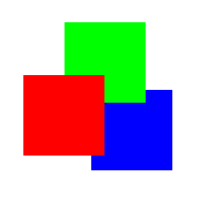

# GUI-Frameworks 

This repository contains two projects, gfworks and jfworks, which were
supposed to be GUI-framework-agnostic GUI-frameworks. Which would mean you
could use the same code to target different GUI-frameworks like GTK or Tk.

Since I mostly use QT these days, the project has kind of ended.

gfworks is a framework for python, jfworks for java.

## Further Information

* [Changelog](https://gitlab.namibsun.net/namboy94/gui-frameworks/raw/master/CHANGELOG)
* [License (GPLv3)](https://gitlab.namibsun.net/namboy94/gui-frameworks/raw/master/LICENSE)
* [Gitlab](https://gitlab.namibsun.net/namboy94/gui-frameworks)
* [Github](https://github.com/namboy94/gui-frameworks)
* [Git Statistics (gitstats)](https://gitstats.namibsun.net/gitstats/gui-frameworks/index.html)
* [Git Statistics (git_stats)](https://gitstats.namibsun.net/git_stats/gui-frameworks/index.html)
